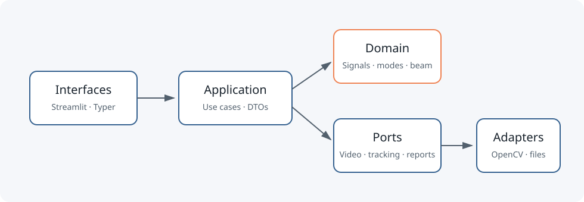

# ModeLens — Video-to-Modal Digital Twin

> Turn an ordinary vibration video into an explainable modal experiment.

[](https://www.python.org/)
[](LICENSE)

ModeLens is a local Python laboratory for a simple flexible specimen such as a
cantilever ruler. It tracks multiple points from video, cleans their displacement
signals, separates spatial patterns with POD/SVD, estimates modal frequency and
damping, and calibrates the identifiable parameter of an Euler–Bernoulli beam twin.

The project exists to make the full chain inspectable. A frequency is linked to the
video hash, tracking confidence, preprocessing record, spectrum, spatial shape,
uncertainty interval and physical-model residual—not just a peak on an unexplained FFT.

> **Scope:** educational and controlled experiments only. ModeLens is not calibrated
> instrumentation, structural certification or a safety/damage diagnostic.



## Verified repository snapshot

The bundled videos are generated locally from recorded ground truth; they are not
third-party or real-world measurements. Values below are populated only from the final
verification run included with this release:

| Check | Measured result |
|---|---|
| Unit/integration tests | 37 passed; separate E2E smoke test passed |
| Coverage | 86.04% (configured testable source) |
| Baseline frequencies | 3.499963 Hz and 21.910112 Hz |
| Baseline relative frequency error | 0.001043% and 0.046175% |
| 720p/10 s demo analysis runtime | 25.964 s |
| Peak process RSS | 281.875 MiB |

Real-specimen repeatability is intentionally **not claimed**: no real capture was
provided with the repository. Follow `docs/experiment_protocol.md` and publish only
measurements you actually obtain. The exact environment, hashes, commands and
comparison outcome are in [`docs/validation_report.md`](docs/validation_report.md),
with the benchmark payload stored under `docs/validation/`.

## Quickstart

Prerequisites: Python 3.12, [`uv`](https://docs.astral.sh/uv/) and a CPU. No API key,
GPU, cloud account or external dataset is required.

```bash
uv sync --all-groups
uv run python scripts/build_demo_assets.py
uv run modelens demo --output runs/demo
```

Open `runs/demo/report.html`, then launch the interactive application:

```bash
make demo
```

The app has five pages: capture and quality, tracking, modal analysis, restricted
digital twin and baseline/modified comparison. The preferred current Streamlit page
API uses `st.Page` and `st.navigation`; the app entrypoint follows that model.

## Reproducible commands

```bash
uv run modelens analyze \
  --video data/samples/cantilever_baseline.mp4 \
  --config configs/demo_cantilever.yaml \
  --output runs/baseline

uv run modelens analyze \
  --video data/samples/cantilever_modified.mp4 \
  --config configs/demo_cantilever.yaml \
  --output runs/modified

uv run modelens compare \
  --baseline runs/baseline/result.json \
  --modified runs/modified/result.json \
  --output runs/comparison

uv run modelens synthetic \
  --frequency 3.5 --damping 0.025 --output data/raw/synthetic.mp4

make quality
make test
make test-e2e
make benchmark
```

Each analysis explicitly exports:

- `result.json`: complete versioned domain result;
- `arrays.npz`: compact numerical arrays;
- `signals.csv` and `trajectories.csv`: interoperable derived data;
- `tracking_overlay.mp4`: visual tracking audit;
- `report.html`: self-contained report with Plotly embedded.

Raw user media is read in place and is never copied into the run directory.

## Scientific pipeline

1. Decode actual metadata and reject corrupt, oversized or overlong input.
2. Measure blur, contrast, saturation and apparent global camera movement.
3. Track stations with pyramidal Lucas–Kanade plus a forward/backward check, or use the
   explicit bright-contour adapter for a high-contrast specimen.
4. Project movement onto the axis normal; retain the raw signal and validity mask.
5. Interpolate bounded internal gaps, apply Hampel outlier rejection, linear detrending
   and a zero-phase Butterworth band-pass.
6. Decompose the time × station matrix using SVD/POD and inspect Welch spectra of the
   modal coordinates.
7. Estimate damping only when at least five peaks follow an approximately exponential
   decay. Otherwise return `null` with a reason.
8. Bootstrap spectral windows with a recorded seed for frequency intervals.
9. Fit `EI/(rho*A)` and report residuals. Derive `E` only when geometry and density are
   fixed externally.
10. Pair two experiments with frequency plus Modal Assurance Criterion (MAC), using only
    `stable`, `measurable_change` and `inconclusive` labels.

For equations, assumptions and units, read [`docs/mathematical_model.md`](docs/mathematical_model.md).
The implementation/evidence mapping for every `ML-F01`–`ML-F10` requirement is in
[`docs/requirements_traceability.md`](docs/requirements_traceability.md).

## Architecture and design

```text
interfaces (Streamlit, Typer)
        │
        ▼
application use cases ─────► ports
        │                      ▲
        ▼                      │
domain services          adapters (OpenCV, files, Jinja/Plotly)
```

Dependencies point inward. The domain has no OpenCV, Streamlit, filesystem or report
dependency. Swapping a tracker does not modify `AnalyzeVideo`. Stable mathematical
functions are not hidden behind unnecessary interfaces. See the three ADRs under
`docs/decisions/`.

## Record your own experiment

Use a plastic ruler or thin wood strip, a high-contrast background, a stable phone at
60/120 fps and a scale in the same image plane. Keep 15–20% clamped, record 5–10 seconds,
deflect gently and release. Repeat three times before and after any controlled change.
The complete safety, capture and acceptance procedure is in
[`docs/experiment_protocol.md`](docs/experiment_protocol.md).

Camera compression, rolling shutter, quantisation, timestamp error and perspective can
all bias a result. If a mode approaches `0.4 × FPS`, tracking is unstable or intervals
cannot be estimated, treat the result as inconclusive. Full limitations are next to the
implementation in [`docs/limitations.md`](docs/limitations.md).

## Validation strategy

- Analytic checks for cantilever frequencies, shapes, MAC and parameter recovery.
- Property tests for MAC scale/sign invariance and numerical bounds.
- Synthetic arrays with two known modes, damping, noise and a fixed seed.
- Generated video through OpenCV contour tracking to modal output.
- JSON/CSV/NPZ/report round-trip integration.
- Typer command smoke test and a fixed demo benchmark.
- Ruff formatting/lint, strict mypy on `src/`, Bandit and GitHub Actions.

The synthetic generator records ground truth and refuses frequencies at or above
Nyquist. MP4 hashes can change with codecs, so acceptance checks decoded motion and
numeric tolerance; the exact generator, parameters and seed remain recorded.

The final synthetic baseline/modified comparison paired both modes. Mode 1 was labelled
`measurable_change` (`Δf/f = -11.426%`, `MAC = 0.999975`). Mode 2 was correctly labelled
`inconclusive`: its point estimate changed by `-15.121%`, but the deliberately weak
second-mode intervals overlapped. These are synthetic pipeline checks, not physical
findings.

## Project structure

```text
modelens/
├── configs/                 # validated experiment and processing settings
├── data/samples/            # reproducibly generated demo + ground truth
├── docs/                    # Spanish guide, protocol, maths, ADRs, limitations
├── scripts/                 # sample generation and measured benchmark
├── src/modelens/
│   ├── domain/              # entities, signals, modes, beam, uncertainty, comparison
│   ├── application/         # use cases and boundary DTOs
│   ├── ports/               # video, tracking, repository, reporting contracts
│   ├── adapters/            # OpenCV, local artifacts, Plotly and Jinja
│   └── interfaces/          # Typer CLI and five-page Streamlit app
├── templates/               # self-contained report template
└── tests/                   # unit, property, integration and E2E checks
```

## References used by the implementation

- [OpenCV optical-flow tutorial](https://docs.opencv.org/4.x/d4/dee/tutorial_optical_flow.html)
- [SciPy signal-processing API](https://docs.scipy.org/doc/scipy/reference/signal.html)
- [Streamlit multipage navigation](https://docs.streamlit.io/develop/concepts/multipage-apps/page-and-navigation)
- [uv project dependency groups](https://docs.astral.sh/uv/concepts/projects/dependencies/)

These references document software APIs. The physical assumptions used by ModeLens are
stated directly in the mathematical model and validated against analytic synthetic data.

## Roadmap

- Re-detection of lost Lucas–Kanade stations and optional affine stabilisation output.
- Half-power damping as a second estimator with agreement diagnostics.
- Monte Carlo propagation of measured scale/FPS uncertainty into the twin.
- A small, consented real-video dataset with three-repeat reports.

## Contributing, citation and licence

Read [`CONTRIBUTING.md`](CONTRIBUTING.md). Cite the software with `CITATION.cff`.
Code is available under the [MIT License](LICENSE). User and third-party videos retain
their own rights and must not be committed without permission.
